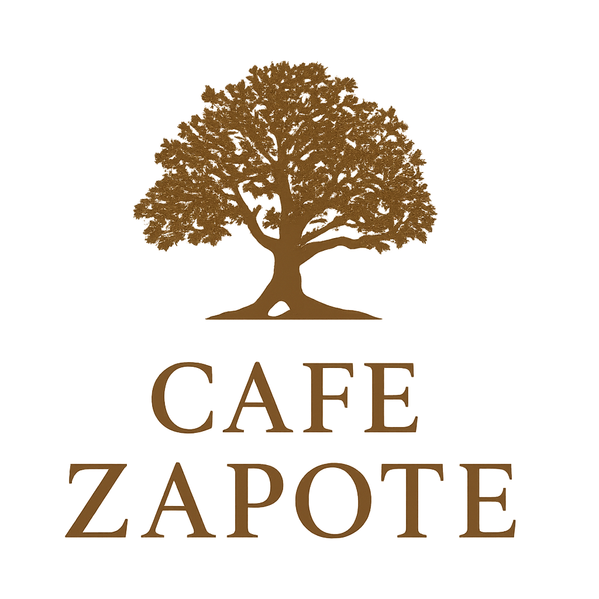

# ☕ Café Zapote - Sitio Web Oficial

**Tradición que florece en cada taza**

Sitio web oficial de Café Zapote, marca familiar de café 100% orgánico cultivado en las montañas de Mesillas, Nayarit, México.



## 🌿 Sobre el Proyecto

Este sitio web representa la historia y tradición de la familia Salazar, que por más de 30 años ha cultivado café orgánico bajo la sombra de un zapote centenario. El sitio está diseñado para mostrar nuestros valores, historia y conectar con clientes potenciales que buscan café de origen con alma.

## ✨ Características

- **🏠 Página de Inicio**: Hero impactante con imagen de taza de café animada y galería de fotos
- **📖 Página de Historia**: Narrativa visual de nuestras raíces familiares y proceso artesanal
- **📱 Página de Contacto**: Tarjetas interactivas para contacto directo por redes sociales
- **🎨 Diseño Moderno**: Tema claro con colores cálidos inspirados en café y naturaleza
- **📱 Totalmente Responsive**: Optimizado para desktop, tablet y móvil
- **⚡ Rendimiento**: Construido con Vite para carga ultra-rápida
- **🔗 SEO Optimizado**: Meta tags para compartir en redes sociales

## 🛠️ Tecnologías

- **Frontend Framework**: React 18 con TypeScript
- **Build Tool**: Vite 5
- **Routing**: React Router DOM v6
- **Styling**: CSS personalizado con variables CSS
- **Fonts**: Google Fonts (Playfair Display, Montserrat)
- **Deployment**: Firebase Hosting
- **Version Control**: Git & GitHub

## 🚀 Instalación y Desarrollo

### Prerequisitos

- Node.js 16+ 
- npm o yarn

### Instalación

```bash
# Clonar el repositorio
git clone https://github.com/DGOSalazar/cafezapotewebapp.git

# Entrar al directorio
cd cafezapotewebapp

# Instalar dependencias
npm install

# Iniciar servidor de desarrollo
npm run dev
```

El sitio estará disponible en `http://localhost:5173`

## 📦 Scripts Disponibles

```bash
npm run dev      # Inicia el servidor de desarrollo
npm run build    # Construye la versión de producción
npm run preview  # Previsualiza la versión de producción
npm run lint     # Ejecuta el linter
```

## 🌐 Deployment

El sitio está desplegado en Firebase Hosting:

**URL**: [https://cafezapote.web.app](https://cafezapote.web.app)

### Deploy Manual

```bash
# Construir para producción
npm run build

# Desplegar a Firebase
firebase deploy
```

## 📂 Estructura del Proyecto

```
cafe-zapote-website/
├── public/                      # Archivos estáticos
│   ├── logo-cafe-zapote.png    # Logo principal
│   ├── background1.jpg          # Fondo de página
│   ├── topImage.jpg             # Imagen hero de taza
│   └── WhatsApp Image...        # Galería de imágenes
├── src/
│   ├── components/
│   │   └── Layout.tsx           # Layout principal con header/footer
│   ├── pages/
│   │   ├── Home.tsx             # Página de inicio
│   │   ├── History.tsx          # Página de historia
│   │   └── Quote.tsx            # Página de contacto
│   ├── App.tsx                  # Componente raíz
│   ├── main.tsx                 # Entry point
│   └── styles.css               # Estilos globales
├── index.html                   # HTML principal
├── vite.config.ts               # Configuración de Vite
├── tsconfig.json                # Configuración de TypeScript
└── firebase.json                # Configuración de Firebase

```

## 🎨 Paleta de Colores

```css
--bg: #f9f4ec           /* Crema natural */
--bg-elevated: #ffffff  /* Blanco */
--accent: #8b5a2b       /* Marrón tierra */
--text: #2d1f14         /* Marrón oscuro */
--muted: #8b7355        /* Gris cálido */
```

## 📱 Redes Sociales

- **WhatsApp**: [+52 220 588 3369](https://wa.me/522205883369)
- **Facebook**: [@CafeZapote](https://www.facebook.com/CafeZapote)
- **Instagram**: [@cafe_zapote_](https://www.instagram.com/cafe_zapote_/)
- **TikTok**: [@cafezapote](https://www.tiktok.com/@cafezapote)

## 👨‍💻 Desarrollo

Este proyecto fue desarrollado con las mejores prácticas de React y TypeScript:

- **Componentes Funcionales** con hooks
- **TypeScript** para type safety
- **CSS Modular** con variables y responsive design
- **Routing** con React Router para navegación SPA
- **Optimización** de imágenes y assets
- **SEO** con meta tags Open Graph

## 📄 Licencia

© 2024 Café Zapote. Todos los derechos reservados.

## 👥 Contacto

Para consultas sobre el sitio web o la marca:

- **Email**: Contactar vía redes sociales
- **WhatsApp**: +52 220 588 3369
- **Ubicación**: Mesillas, Compostela, Nayarit, México

---

**Hecho con ❤️ y ☕ por la familia Salazar**
